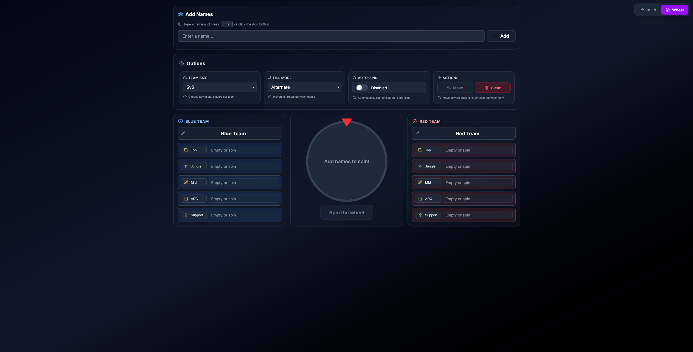

# LifeGoal's Randomizer
**Spice up your League of Legends games with completely randomized builds!**

**[Try it now: lifegoals-randomizer.vercel.app](https://lifegoals-randomizer.vercel.app/)**

## Preview

  
Build randomizer

  

  
Team randomizer wheel

  

## What is this?

Tired of the same meta builds every game? Want to challenge yourself or just have some fun? This randomizer generates completely random League of Legends champion builds with:

- **Random Champions** matched to your selected role
- **Complete Item Builds** including starter items, boots, and full builds
- **Rune Pages** with keystone, primary, secondary, and stat shards
- **Summoner Spells** tailored to your role
- **Ability Maxing Order** for ultimate chaos

## Difficulty Modes

Choose how wild you want to go:

- **Easy** - Meta-friendly builds that actually make sense
- **Moderate** - Slightly off-meta, still playable
- **Normal** - Balanced chaos
- **Challenging** - Things get weird
- **Hard** - Prepare for confusion
- **Chaos** - Pure madness. Anti-meta everything.

## Features

- Smart role-based champion selection  
- Difficulty-adjusted item and rune generation  
- Support & Jungle role-specific items  
- Responsive design for mobile and desktop  
- Up-to-date with latest League patches  
- Health potion calculation (500g starter budget)  
- Champion splash art with fallback support

---

Perfect for challenge runs, content creation, or just breaking the monotony of ranked games. Give it a try!

**Note:** This is a community project and is not affiliated with Riot Games.
**Also note:** This project is not open source. That is why I've opened up this repository to get feedback from you users. I would appreciate if you could help me find issues and things that I can improve.
